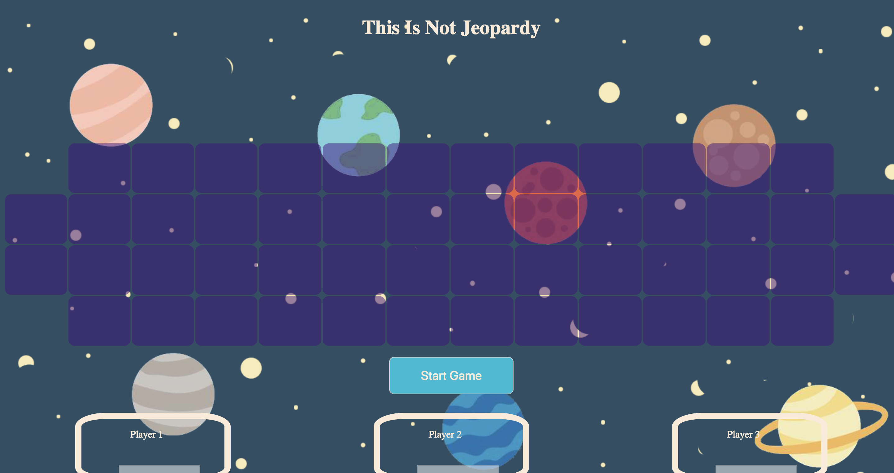
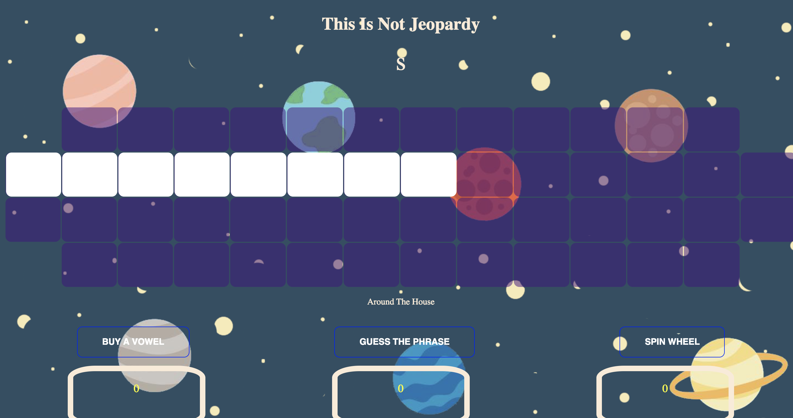

# Wheel of Fortune 




## Descriptions:

web application where you can play your favorite game show wheel of fortune. the application allows you to bring back those good memories of sitting on the couch watching the tv show to your screen where you can interact with.

## Click Here To Play
https://niroz11.github.io/wheel-of-fortune/

## Getting Started:

These instructions will get a copy of the project up and running on your local machine for usage and testing purposes. 

clone down the repository:
```
$ git clone https://github.com/niroz11/wheel-of-fortune.git
```

cd into directory and run npm install:
```
$ npm install
```

launch in your browser:
```
$ npm start
```

## Project Tools:
HTMl
Javascript
CSS
Jquery

## Future Development and Extensions Notes:
Add bonus round at the end
Fix animations and transitions

## Original Assignment
[GameTime, Mod 2 at the Turing School of Software and Design](http://frontend.turing.io/projects/wheel-of-fortune.html)

## Contributors
Niraj Aryal:  https://github.com/niroz11

Gabriel Inzurriaga: https://github.com/Inzurriaga